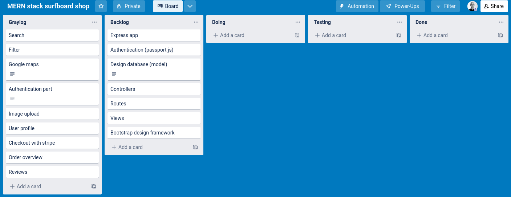
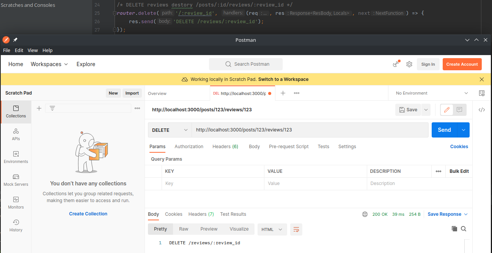
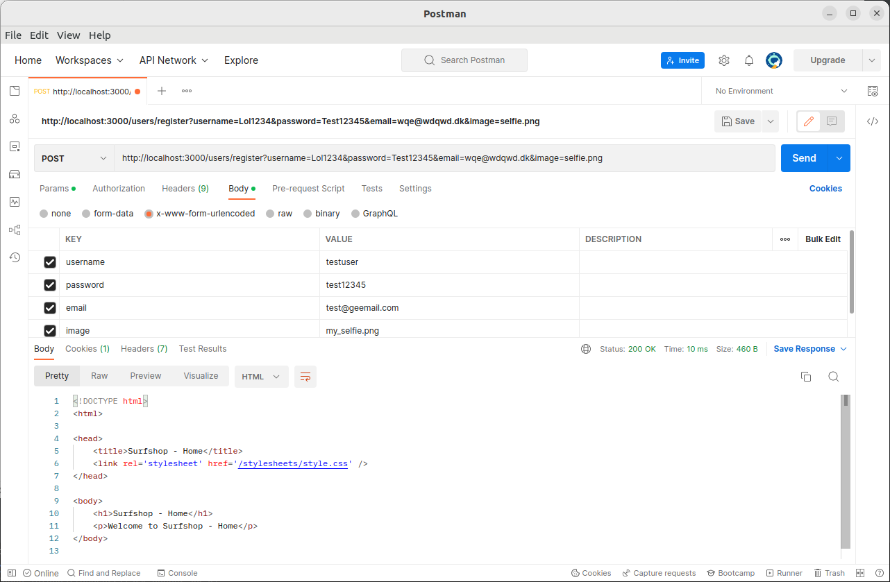

# MERN stack surfboard shop

## Dokumentation af projektet
Projektet går ud på at lave en surfboard shop med ofte anvendte funktionaliteter fra webshops, heriblandt:
1. User authentication
2. Profile section
3. Administration panel
4. Search
5. Filters
6. Google maps
7. Checkout
8. Order overview
9. Reviews

Jeg anvender Trello som "Project management" værktøj, og min opstart af projektet ser således ud:<br />


Jeg laver projektet med ExpressJS framework, hvilket er et web framework generelt brugt til opbygning af RESTful API'er med NodeJS.<br />
Det første jeg gør efter installation, er at installerer de npm pakker jeg skal bruge i projektet:
1. dotenv (til opbevaring af følsomme oplysninger)
2. locus (til debugging)
3. mongoose (MongoDB ODM library)
4. passport (authentication library)
5. nodemon (Kørsel af app med automatisk genstart ved opdateringer i koden)

Efterfølgende, har jeg tilpasset mine routes ud fra min nogenlunde gennemtænkte struktur.<br />
Routes tester jeg altid løbende, i dette tilfælde har jeg testet med Postman, eksempel herunder: <br />


Alt hvad der hedder *User authentication* og *Password Security* kører jeg igennem tre npm biblioteker kaldet _passport_, _passport-local-mongoose_ og _express-session_. <br />
Inden jeg fortsætter implementering af bruger funktionalitet, tester mit mongoose passport setup i postman, med en bruger oprettelse: <br />


Efter at have lavet mine routes samt crud funktionalitet, skal jeg til at implementere image upload til mine posts, det gør jeg i dette omgang med cloudinary,<br />
Dokumentationen til cloudinary kan findes her: https://cloudinary.com/documentation/node_integration <br />
Cloudinary er gratis, og let at bruge, der skal dog installeres en npm pakke til dette: "cloudinary" og "multer" <br />
Cloudinary library er den del som giver adgang til have have billeder i skyen, multer er den del som skal benyttes i projektes form, for at vælge billeder. <br />

## Kørsel
### Nødvendigheder for at kunne køre projektet
1. *nodejs*
2. *npm*
3. *nodemon*
4. *mongodb* _( https://www.mongodb.com/docs/v4.2/tutorial/install-mongodb-on-ubuntu/ )_
5. *mongodb-org*

### For at køre applikationen
1. klon projektet ned.
2. cd til surf-shop
3. kør: sudo npm i (installerer alle npm pakker som nævnt i dokumentationen)
4. Indsæt Cloudinary secret i .env, samt api_key og api_name i controllers/posts.js. (Findes i https://cloudinary.com/console/)
4. kør: sudo systemctl start mongod (Starter lokale mongodb server op)
5. kør: nodemon (Starter automatisk bin/www startup script, hvis ikke der tilføjes fil som parameter)

## Fremhævet kode i projektet
Herunder har jeg valgt at fremvise nogle eksempler på kode benyttet i projektet.
### Edit post submit validering ift. mængden af billeder i en post.
Scriptet herunder tjekker op på, om mængden af billeder overskriver maksimum af tilladte billeder i en post, når en post redigeres.
```javascript
// Find post edit form.
let postEditForm = document.getElementById('postEditForm');
// Add submit listener to post edit form.
postEditForm.addEventListener('submit', function (event) {
    // Find amount of images to be uploaded.
    let imagesToUpload = document.getElementById('imageUpload').files.length;
    // Find total number of existing images.
    let existingImages = document.querySelectorAll('.imageDeleteCheckbox').length;
    // Find total number of images selected to be deleted.
    let imagesToBeDeleted = document.querySelectorAll('.imageDeleteCheckbox:checked').length;

    // Figure out if the form can be submitted or not (images total has to be <= 4, otherwise fail).
    let newTotal = existingImages - imagesToBeDeleted + imagesToUpload;
    if (newTotal > 4) {
        event.preventDefault();
        let removalAmount = newTotal - 4;
        // Ternary operator used here, to add an s there is more than one image.
        alert(`You need to remove at least ${removalAmount} image${removalAmount === 1 ? '' : 's'}!`);
    }
});
```

### Edit post, som fjerner valgte billeder fra post og cloudinary, samt opdaterer post data og cloudinary med nye billeder.
```javascript
// Posts update
async postUpdate(req, res, next) {
    // Find the post by id.
    let post = await Post.findById(req.params.id);
    // Check if there's any images for deletion. (deleteImages comes from the body parser)
    if(req.body.deleteImages && req.body.deleteImages.length) {
        // assign deleteImages from req.body to its own variable.
        let deleteImages = req.body.deleteImages;
        //loop over deleteImages.
        for(const public_id of deleteImages) {
            // Delete image from cloudinary.
            await cloudinary.v2.uploader.destroy(public_id);
            // Delete image from post.images.
            for(const image of post.images) {
                if(image.public_id === public_id) {
                    let index = post.images.indexOf(image);
                    // Remove image with splice.
                    post.images.splice(index, 1);
                }
            }
        }
    }
    // Check if there are any new images for upload.
    if(req.files) {
        // Upload images.
        for (const file of req.files) {
            let image = await cloudinary.v2.uploader.upload(file.path);
            // Add images to post.images array.
            post.images.push({
                url: image.secure_url,
                public_id: image.public_id
            });
        }
    }
    // Update the post properties.
    post.title = req.body.post.title;
    post.description = req.body.post.description;
    post.price = req.body.post.price;
    post.location = req.body.post.location;

    // Save the updated post into the db.
    post.save();
    // Redirect back to the post view.
    res.redirect(`/posts/${post.id}`);
}
```

### Andet sjovt eksempel af kode, kommer snarest. 