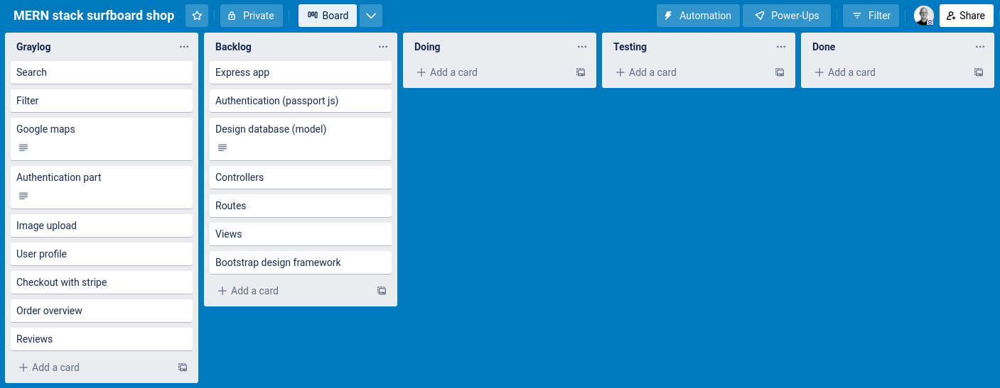

# MERN stack surfboard shop

## Dokumentation af projektet
Projektet går ud på at lave en surfboard shop med ofte anvendte funktionaliteter fra webshops, heriblandt:
1. User authentication
2. Profile section
3. Administration panel
4. Search
5. Filters
6. Google maps
7. Checkout
8. Order overview
9. Reviews

Jeg anvender Trello som "Project management" værktøj, og min opstart af projektet ser således ud: 

Jeg laver projektet med ExpressJS framework, hvilket er et web framework generelt brugt til opbygning af RESTful API'er med NodeJS. 
Det første jeg gør efter installation, er at installerer de npm pakker jeg skal bruge i projektet:
1. dotenv (til opbevaring af følsomme oplysninger)
2. locus (til debugging)
3. mongoose (MongoDB ODM library)
4. passport (authentication library)
5. nodemon (Kørsel af app med automatisk genstart ved opdateringer i koden)

## Kørsel
### Nødvendigheder for at kunne køre projektet
1. nodejs
2. npm
3. 

### For at køre applikationen
1. klon projektet ned.
2. cd til surf-shop
3. kør: sudo npm i (installerer alle npm pakker som nævnt i dokumentationen)
4. kør: nodemon (Starter automatisk bin/www startup script, hvis ikke der tilføjes fil som parameter)
5. 

